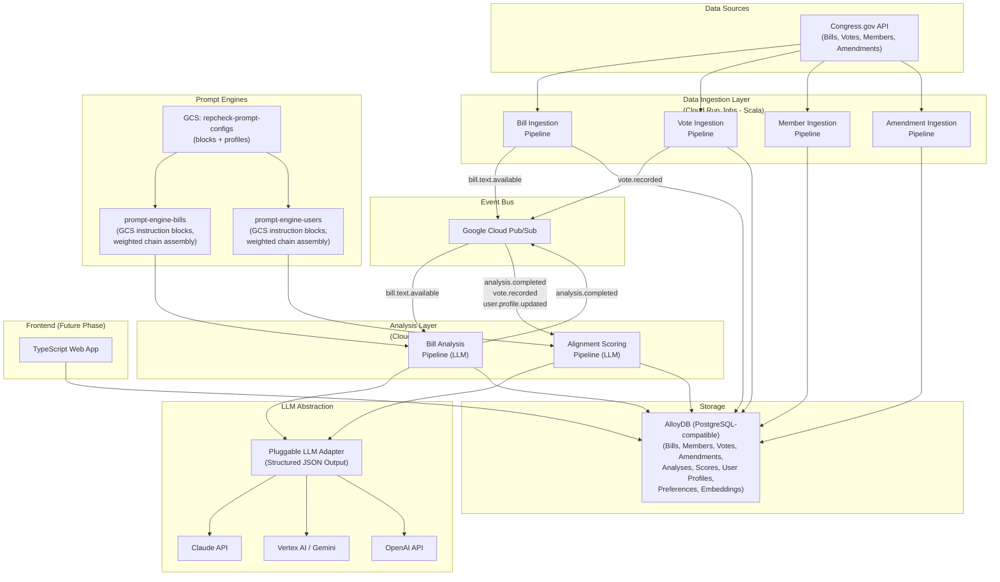

<!-- GENERATED FILE — DO NOT EDIT. Source: docs/architecture/system-design/02-architecture.md -->

# High-Level Architecture

```mermaid
graph TB
    subgraph "Data Sources"
        CONGRESS_API["Congress.gov API<br/>(Bills, Votes, Members, Amendments)"]
    end

    subgraph "Event Bus"
        PUBSUB["Google Cloud Pub/Sub"]
    end

    subgraph "Data Ingestion Layer<br/>(Cloud Run Jobs - Scala)"
        BILL_INGEST["Bill Ingestion<br/>Pipeline"]
        VOTE_INGEST["Vote Ingestion<br/>Pipeline"]
        MEMBER_INGEST["Member Ingestion<br/>Pipeline"]
        AMENDMENT_INGEST["Amendment Ingestion<br/>Pipeline"]
    end

    subgraph "Prompt Engines"
        PE_B["prompt-engine-bills<br/>(GCS instruction blocks,<br/>weighted chain assembly)"]
        PE_U["prompt-engine-users<br/>(GCS instruction blocks,<br/>weighted chain assembly)"]
        GCS_PROMPTS["GCS: repcheck-prompt-configs<br/>(blocks + profiles)"]
    end

    subgraph "Analysis Layer<br/>(Cloud Run Jobs - Scala)"
        BILL_ANALYSIS["Bill Analysis<br/>Pipeline (LLM)"]
        SCORING["Alignment Scoring<br/>Pipeline (LLM)"]
    end

    subgraph "LLM Abstraction"
        LLM_ADAPTER["Pluggable LLM Adapter<br/>(Structured JSON Output)"]
        CLAUDE["Claude API"]
        GEMINI["Vertex AI / Gemini"]
        OPENAI["OpenAI API"]
    end

    subgraph "Storage"
        ALLOYDB["AlloyDB (PostgreSQL-compatible)<br/>(Bills, Members, Votes, Amendments,<br/>Analyses, Scores, User Profiles,<br/>Preferences, Embeddings)"]
    end

    subgraph "Frontend (Future Phase)"
        WEB["TypeScript Web App"]
    end

    CONGRESS_API --> BILL_INGEST
    CONGRESS_API --> VOTE_INGEST
    CONGRESS_API --> MEMBER_INGEST
    CONGRESS_API --> AMENDMENT_INGEST

    BILL_INGEST -->|"bill.text.available"| PUBSUB
    VOTE_INGEST -->|"vote.recorded"| PUBSUB

    PUBSUB -->|"bill.text.available"| BILL_ANALYSIS
    PUBSUB -->|"analysis.completed<br/>vote.recorded<br/>user.profile.updated"| SCORING

    GCS_PROMPTS --> PE_B
    GCS_PROMPTS --> PE_U
    PE_B --> BILL_ANALYSIS
    PE_U --> SCORING
    BILL_ANALYSIS --> LLM_ADAPTER
    SCORING --> LLM_ADAPTER
    LLM_ADAPTER --> CLAUDE
    LLM_ADAPTER --> GEMINI
    LLM_ADAPTER --> OPENAI

    BILL_INGEST --> ALLOYDB
    VOTE_INGEST --> ALLOYDB
    MEMBER_INGEST --> ALLOYDB
    AMENDMENT_INGEST --> ALLOYDB
    BILL_ANALYSIS -->|"analysis.completed"| PUBSUB
    BILL_ANALYSIS --> ALLOYDB
    SCORING --> ALLOYDB

    WEB --> ALLOYDB
```