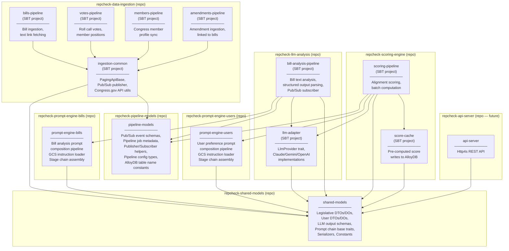

<!-- GENERATED FILE — DO NOT EDIT. Source: docs/architecture/system-design/04-repo-structure.md -->

# Repository & Project Structure

Each major component is its own Git repository. Sub-items within a repository are SBT projects (multi-project builds). Shared dependencies are published as versioned library artifacts.

## Repository Summary

| Repository | SBT Projects | Purpose |
|---|---|---|
| **repcheck-shared-models** | `shared-models` | Published library: legislative DTOs/DOs, user DTOs/DOs, LLM output schemas, prompt chain base traits, serializers |
| **repcheck-pipeline-models** | `pipeline-models` | Published library: Pub/Sub event schemas, pipeline job metadata/status, publisher/subscriber helpers, pipeline config types, AlloyDB table name constants |
| **repcheck-data-ingestion** | `ingestion-common`, `bills-pipeline`, `votes-pipeline`, `members-pipeline`, `amendments-pipeline` | Data pipelines fetching from Congress.gov API |
| **repcheck-prompt-engine-bills** | `prompt-engine-bills` | Bill analysis prompt composition, GCS block loading |
| **repcheck-prompt-engine-users** | `prompt-engine-users` | User scoring prompt composition, GCS block loading |
| **repcheck-llm-analysis** | `llm-adapter`, `bill-analysis-pipeline` | Pluggable LLM providers + bill analysis pipeline |
| **repcheck-scoring-engine** | `scoring-pipeline`, `score-cache` | Alignment scoring + AlloyDB score caching |
| **repcheck-api-server** | `api-server` | REST API (future phase) |

## Cross-Repo Dependency Management

- **`repcheck-shared-models`** and **`repcheck-pipeline-models`** published as versioned artifacts (GitHub Packages or GCS Maven repo)
- `repcheck-shared-models` has no repcheck dependencies (root domain library)
- `repcheck-pipeline-models` has no repcheck dependencies (root operational library)
- Pipeline repos depend on both `repcheck-shared-models` (domain types) and `repcheck-pipeline-models` (operational types)
- Non-pipeline repos depend only on `repcheck-shared-models`
- `repcheck-llm-analysis` depends on `repcheck-prompt-engine-bills` as published artifact
- `repcheck-scoring-engine` depends on `repcheck-llm-analysis` (for adapter) and `repcheck-prompt-engine-users` as published artifacts
- Artifact publishing automated via GitHub Actions on tagged releases