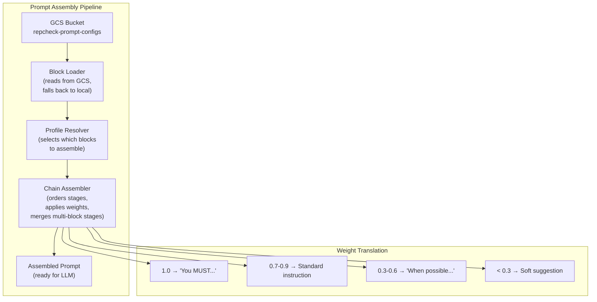

<!-- GENERATED FILE — DO NOT EDIT. Source: docs/architecture/system-design/05-component-details.md -->

# repcheck Documentation — LLM Context

## 1a. `repcheck-shared-models` (Repository)

**Purpose**: Published library containing domain data types for legislative, user, and analysis data.

**Contents**:
- **Legislative DOs**: `LegislativeBillDO`, `MemberDO`, `VoteDO`, `AmendmentDO`
- **Analysis DOs**: `BillAnalysisDO`, `AlignmentScoreDO`
- **User DOs**: `UserDO`, `PreferenceDO`, `QaResponseDO`
- **DTOs**: Congress.gov API response models (bills, votes, members, amendments)
- **LLM Output Schemas**: Structured JSON schemas all LLM providers must conform to:
  - `BillSummary`: plain-language summary
  - `TopicClassification`: topic tags with confidence scores
  - `StanceClassification`: political stance per topic (conservative/progressive/bipartisan)
  - `PorkDetection`: riders, earmarks, unrelated provisions
  - `ImpactAnalysis`: affected demographics, sectors, regions
  - `FiscalEstimate`: projected cost/savings
- **Prompt Chain Base Traits**: `InstructionBlock`, `PromptProfile`, `ChainAssembler`, weight translation logic
- **Serializers & Constants**: Circe codecs for ZonedDateTime, etc.

**Depends on**: Nothing

---

## 1b. `repcheck-pipeline-models` (Repository)

**Purpose**: Published library for pipeline operational types — pub/sub events, job metadata, configuration.

**Contents**:
- **Pub/Sub Event Schemas**: `BillTextAvailableEvent`, `VoteRecordedEvent`, `AnalysisCompletedEvent`, `UserProfileUpdatedEvent`
- **Pub/Sub Helpers**: Event publisher/subscriber utilities, topic configuration, message serialization
- **Pipeline Job Metadata**: Status tracking (running, succeeded, failed), progress reporting, error types
- **Pipeline Configuration Types**: Scheduling, batch sizes, retry policies, rate limits
- **AlloyDB Table Constants**: `Tables` object with all table name constants

**Depends on**: Nothing

---

## 3. `repcheck-prompt-engine-bills` (Repository)

**Purpose**: Composes LLM prompts for bill analysis by assembling configurable instruction blocks into a weighted pipeline chain.

#### Instruction Block

Atomic unit of prompt composition. Named, versioned YAML/JSON config files stored in GCS:

```yaml
# gs://repcheck-prompt-configs/bills/blocks/fiscal-lens.yaml
name: "fiscal-lens"
stage: "lens"
weight: 0.8
version: "1.2.0"
content: |
  Analyze the fiscal implications of this bill. Identify:
  - Direct costs to federal/state budgets
  - Revenue impacts (taxes, fees, subsidies)
  - Long-term fiscal trajectory (5yr, 10yr projections)
  Focus on CBO-style impact estimation.
```

#### Block Types

| Stage | Purpose | Example |
|-------|---------|---------|
| `system` | Base system role and behavioral instructions | "You are a nonpartisan legislative analyst..." |
| `persona` | Analyst persona shaping tone and depth | "Write for a general audience at an 8th-grade reading level..." |
| `lens` | Interpretive focus area (additive, multiple allowed) | "fiscal-lens", "civil-liberties-lens", "healthcare-lens" |
| `context` | Dynamic context injected at runtime | Bill text, amendment text, related bills |
| `guardrails` | Safety constraints and bias prevention | "Do not express political opinions or party preferences..." |
| `output` | Output format and schema directives | "Return a JSON object conforming to BillAnalysis schema..." |

#### Pipeline Chain Assembly

Blocks assembled in defined order; dynamically extensible:

```
system → persona → lens(es) → context → [custom stages...] → guardrails → output
```

A **prompt profile** defines which blocks compose a specific analysis type:

```yaml
# gs://repcheck-prompt-configs/bills/profiles/full-analysis.yaml
name: "full-analysis"
chain:
  - stage: "system"
    blocks: ["base-legislative-analyst"]
    weight: 1.0
  - stage: "persona"
    blocks: ["general-audience"]
    weight: 0.9
  - stage: "lens"
    blocks: ["fiscal-lens", "civil-liberties-lens", "pork-detector"]
    weight: 0.8
  - stage: "context"
    blocks: ["bill-text", "amendments"]
    weight: 1.0
  - stage: "guardrails"
    blocks: ["nonpartisan-constraint", "accuracy-constraint"]
    weight: 1.0
  - stage: "output"
    blocks: ["bill-analysis-json-schema"]
    weight: 1.0
```

#### Weight Semantics

Weights (0.0–1.0) control emphasis signaling:
- **1.0**: "You MUST..." (critical)
- **0.7–0.9**: Standard instruction (important)
- **0.3–0.6**: "When possible..." (advisory)
- **< 0.3**: Soft suggestion (de-emphasized)

#### GCS Layout

```
gs://repcheck-prompt-configs/
  └── bills/
      ├── blocks/
      │   ├── system/
      │   ├── persona/
      │   ├── lens/
      │   ├── guardrails/
      │   └── output/
      └── profiles/
          ├── full-analysis.yaml
          ├── summary-only.yaml
          └── pork-detection.yaml
```

Config files version-controlled in repo under `prompt-configs/bills/`; GitHub Action deploys to GCS on merge to main; runtime reads from GCS with local file fallback.

**Depends on**: `repcheck-shared-models`

---

## 4. `repcheck-prompt-engine-users` (Repository)

**Purpose**: Composes LLM prompts for user preference interpretation and alignment scoring. Same pipeline-chain architecture as `repcheck-prompt-engine-bills`.

#### Block Types

| Stage | Purpose | Example |
|-------|---------|---------|
| `system` | Base system role for preference analysis | "You are a political preference analyst..." |
| `persona` | Interaction style for scoring explanations | "Explain alignments in plain language with specific bill examples..." |
| `lens` | Scoring methodology focus | "topic-alignment-lens", "voting-consistency-lens" |
| `context` | Dynamic context injected at runtime | User preferences, legislator voting record, bill analyses |
| `guardrails` | Fairness and bias constraints | "Score based on voting record only, not party affiliation..." |
| `output` | Output format for alignment scores | "Return JSON conforming to AlignmentScore schema..." |

#### GCS Layout

```
gs://repcheck-prompt-configs/
  └── users/
      ├── blocks/
      │   ├── system/
      │   ├── persona/
      │   ├── lens/
      │   ├── guardrails/
      │   └── output/
      └── profiles/
          ├── full-alignment.yaml
          ├── topic-breakdown.yaml
          └── quick-score.yaml
```

**Depends on**: `repcheck-shared-models`

---

## 5. Prompt Engine Shared Architecture

Both prompt engines share assembly mechanism defined as base trait in `repcheck-shared-models`:



**GitHub Actions Deployment**:
```
repo: prompt-configs/bills/ ──push──→ gs://repcheck-prompt-configs/bills/
repo: prompt-configs/users/ ──push──→ gs://repcheck-prompt-configs/users/
```

---

## 6. `repcheck-data-ingestion` (Repository)

**Purpose**: Fetches and normalizes Congress.gov API data into AlloyDB. Publishes events for downstream consumers.

#### `ingestion-common` (SBT project)
- Shared infrastructure: `PagingApiBase` trait, Congress.gov API base client, ingestion configuration
- **Depends on**: `repcheck-shared-models`, `repcheck-pipeline-models`

#### `bills-pipeline` (SBT project)
- **Source**: `api.congress.gov/v3/bill`
- Paginated fetch with configurable lookback window; detects new vs. updated bills; fetches bill text links when available
- **Events emitted**: `bill.text.available` (when bill text becomes available)
- **Storage**: AlloyDB `bills` table

#### `votes-pipeline` (SBT project)
- **Source**: `api.congress.gov/v3/vote` (House + Senate roll call votes)
- Fetches roll call votes with member-level positions (Yea/Nay/Present/Not Voting); links votes to bills via bill number
- **Events emitted**: `vote.recorded`
- **Storage**: AlloyDB `votes` table + `vote_positions` table

#### `members-pipeline` (SBT project)
- **Source**: `api.congress.gov/v3/member`
- Syncs current congress member profiles (name, party, state, district, chamber, terms); detects new members and profile changes
- **Events emitted**: None
- **Storage**: AlloyDB `members` table

#### `amendments-pipeline` (SBT project)
- **Source**: `api.congress.gov/v3/amendment`
- Fetches amendments linked to bills; captures sponsor, description, status, and amendment text when available; amendments read by LLM analysis pipeline on-demand
- **Events emitted**: None
- **Storage**: AlloyDB `amendments` table (linked to parent bill)

**Depends on**: `repcheck-shared-models`, `repcheck-pipeline-models`. Each pipeline project depends on `ingestion-common`.

---

## 7. `repcheck-llm-analysis` (Repository)

**Purpose**: Analyzes bill texts using pluggable LLM providers to produce structured intelligence.

#### `llm-adapter` (SBT project)

**Interface**:
```scala
trait LlmProvider {
  def analyze[I, O](input: I, schema: OutputSchema[O]): IO[O]
}
```

**Implementations**:
- `ClaudeProvider` — Anthropic Claude with structured output (tool use)
- `GeminiProvider` — Google Vertex AI with structured output
- `OpenAiProvider` — OpenAI with JSON mode / function calling

All providers return JSON conforming to shared output schemas. Provider-specific structured output features (Claude tool use, OpenAI function calling, Gemini structured output) ensure consistency.

**Configuration**: Provider selection and API keys via config; support for fallback chains.

#### `bill-analysis-pipeline` (SBT project)

**Trigger**: Subscribes to `bill.text.available` events.

**Behavior** (Tiered Analysis):

1. Receives event with bill ID
2. Fetches bill text from AlloyDB
3. Fetches associated amendments from AlloyDB
4. **Bill text decomposition** (for large bills):
   - **Step 1 — Text parsing** (Ollama sidecar): Ollama instance running as Cloud Run sidecar identifies logical sections with boundaries, headings, numbering; persists to `bill_text_sections`. Zero cost.
   - **Step 2 — In-process embedding** (DJL + ONNX Runtime): Embed each section using DJL with all-MiniLM-L6-v2 (~80MB, 384-dim vectors). Zero cost.
   - **Step 3 — Semantic clustering** (Smile ML): Cluster section embeddings using k-means/DBSCAN into concept groups. Zero cost.
   - **Step 4 — LLM simplification** (Haiku): For each concept group, call Haiku using decomposition prompts from `repcheck-prompt-engine-bills` to produce coherent summary. ~$0.001/group.
   - **Result**: Decomposition artifacts in AlloyDB (`bill_text_sections`, `bill_concept_groups`, `bill_concept_group_sections`), tied to text version, reusable across re-analyses. Simplified concept summaries serve as input to analysis passes.
   - **Note**: 384-dim DJL embeddings ephemeral (used only for clustering). 1536-dim embeddings stored in AlloyDB for semantic search generated separately after persistence.
   - Decomposition skipped for short bills fitting within context window.

5. **Pass 1 (Haiku — all bills)**: Structured extraction + classification
   - Input: simplified concept summaries or raw text (short bills)
   - Extract: sponsors, dates, referenced laws, amendment count
   - Classify: policy area/topic tags
   - Generate: plain language summary
   - Store in AlloyDB

6. **Pass 2 (Sonnet — filtered bills)**: Deep analysis
   - Only bills matching relevance filters (active legislation, recent votes, high-profile)
   - Input: simplified concept summaries + Pass 1 results
   - Pork/rider detection, impact analysis, stance classification, fiscal estimates beyond CBO
   - Store in AlloyDB, linked to Pass 1

7. **Pass 3 (Opus — rare)**: Ambiguity resolution
   - Only bills flagged as ambiguous by Pass 2
   - Cross-bill interaction analysis
   - Store in AlloyDB, linked to Pass 1 + 2

8. Publishes `analysis.completed` event after final pass

**Decomposition ownership**: Pipeline owns text parsing (Ollama sidecar), embedding (DJL/ONNX), clustering (Smile), orchestration. Uses prompts from `repcheck-prompt-engine-bills` only for Haiku simplification step.

**Ollama sidecar**: Second container in same Cloud Run Job; hosts small LLM (e.g., Llama 3.2 1B) for format-agnostic text parsing (XML, plain text, PDF-extracted). Communication via localhost HTTP.

**Pass routing**: Configurable rules; defaults: Pass 2 for bills with active vote activity or in user-tracked policy areas; Pass 3 for bills where Pass 2 confidence < threshold.

**Idempotency**: Re-analysis of same bill version produces new analysis version, preserving history.

**Rate limiting**: Configurable concurrency and rate limits per provider and tier.

**Depends on**: `repcheck-shared-models`, `repcheck-pipeline-models`, `repcheck-prompt-engine-bills`. `bill-analysis-pipeline` depends on `llm-adapter`.

---

## 8. `repcheck-scoring-engine` (Repository)

**Purpose**: Computes alignment scores between user political profiles and legislator voting records using LLM-powered reasoning.

#### `scoring-pipeline` (SBT project)

**Trigger**: Subscribes to `analysis.completed`, `vote.recorded`, `user.profile.updated` events.

**Behavior**:
1. For given user + legislator pair: read user profile, legislator's voting record, bill analyses
2. Use `prompt-engine-users` to assemble scoring prompt; load configured profile, inject user preferences and voting context as context blocks
3. Call LLM for structured alignment assessment per topic
4. Aggregate topic scores into overall alignment percentage
5. Write pre-computed score to AlloyDB `scores` table (keyed by `user_id`, `member_id`)

**Batch mode**: When triggered by `analysis.completed` or `vote.recorded`, re-score all affected user-legislator pairs using Cloud Run Jobs for parallelism.

**Incremental**: Only recomputes scores affected by triggering event.

#### `score-cache` (SBT project)

Handles writing pre-computed scores to AlloyDB for fast frontend reads.

#### Score Schema (AlloyDB)

```sql
CREATE TABLE scores (
  user_id       TEXT NOT NULL,
  member_id     TEXT NOT NULL,
  overall_score FLOAT NOT NULL,
  topic_scores  JSONB,
  last_updated  TIMESTAMPTZ,
  scoring_context JSONB,
  PRIMARY KEY (user_id, member_id)
);
```

**Depends on**: `repcheck-shared-models`, `repcheck-pipeline-models`, `repcheck-llm-analysis`, `repcheck-prompt-engine-users`. `scoring-pipeline` depends on `score-cache`.

---

## 9. `repcheck-api-server` (Repository — Future Phase)

**Purpose**: Http4s REST API serving pre-computed data to TypeScript frontend.

**Planned Endpoints**:
- `GET /api/legislators/{memberId}/score?userId=` — alignment score
- `GET /api/user/{userId}/dashboard` — all legislator scores for user's representatives
- `POST /api/user/{userId}/preferences` — submit Q&A responses
- `GET /api/bills/{billId}/analysis` — bill intelligence
- `GET /api/legislators/{memberId}/votes` — voting record

**Depends on**: `repcheck-shared-models`