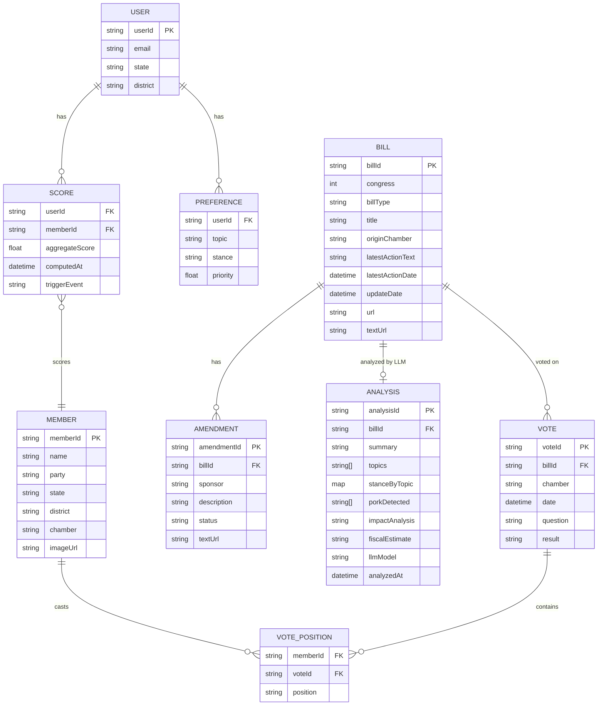

<!-- GENERATED FILE — DO NOT EDIT. Source: docs/architecture/system-design/08-data-model.md -->

# Data Model Overview

```mermaid
erDiagram
    BILL ||--o{ VOTE : "voted on"
    BILL ||--o{ AMENDMENT : "has"
    BILL ||--o| ANALYSIS : "analyzed by LLM"
    MEMBER ||--o{ VOTE_POSITION : "casts"
    VOTE ||--o{ VOTE_POSITION : "contains"
    USER ||--o{ PREFERENCE : "has"
    USER ||--o{ SCORE : "has"
    SCORE }o--|| MEMBER : "scores"

    BILL {
        string billId PK
        int congress
        string billType
        string title
        string originChamber
        string latestActionText
        datetime latestActionDate
        datetime updateDate
        string url
        string textUrl
    }

    MEMBER {
        string memberId PK
        string name
        string party
        string state
        string district
        string chamber
        string imageUrl
    }

    VOTE {
        string voteId PK
        string billId FK
        string chamber
        datetime date
        string question
        string result
    }

    VOTE_POSITION {
        string memberId FK
        string voteId FK
        string position
    }

    AMENDMENT {
        string amendmentId PK
        string billId FK
        string sponsor
        string description
        string status
        string textUrl
    }

    ANALYSIS {
        string analysisId PK
        string billId FK
        string summary
        string[] topics
        map stanceByTopic
        string[] porkDetected
        string impactAnalysis
        string fiscalEstimate
        string llmModel
        datetime analyzedAt
    }

    USER {
        string userId PK
        string email
        string state
        string district
    }

    PREFERENCE {
        string userId FK
        string topic
        string stance
        float priority
    }

    SCORE {
        string userId FK
        string memberId FK
        float aggregateScore
        datetime computedAt
        string triggerEvent
    }
```