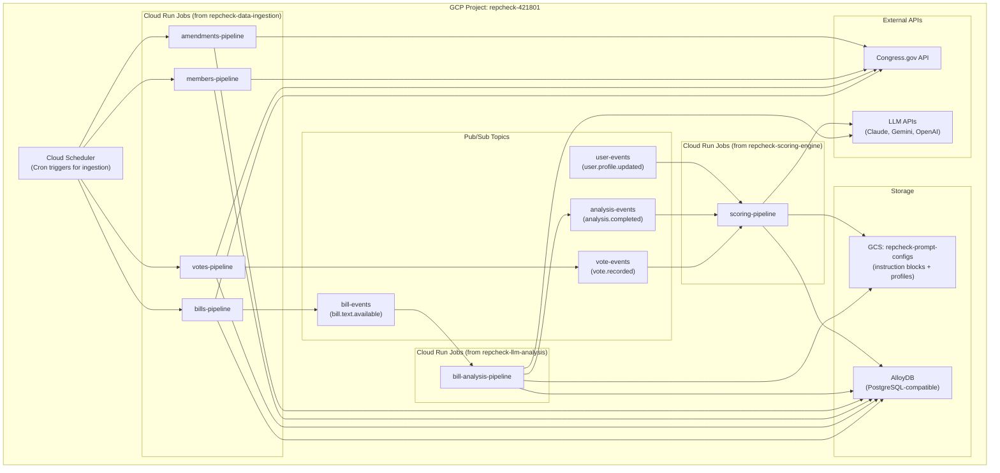

<!-- GENERATED FILE — DO NOT EDIT. Source: docs/architecture/system-design/10-deployment.md -->

# Deployment Architecture

**Architecture Overview:** Serverless event-driven pipeline on GCP. Cloud Scheduler triggers ingestion jobs on schedule. Data pipelines emit Pub/Sub events triggering LLM analysis and scoring. All jobs read/write AlloyDB and external APIs. Prompt configs stored in GCS.