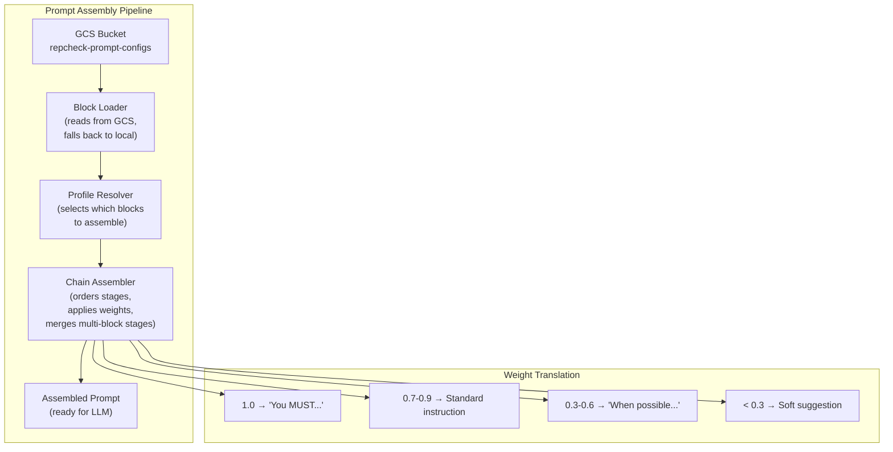

> Part of [System Design](../SYSTEM_DESIGN.md)

## Component Details

### 1a. `repcheck-shared-models` (Repository)

**Purpose**: Published library containing domain data types for legislative, user, and analysis data. Used by all repositories that need to read or write domain entities.

**Contents**:
- **Legislative Domain Objects (DOs)**: `LegislativeBillDO`, `MemberDO`, `VoteDO`, `AmendmentDO`
- **Analysis Domain Objects**: `BillAnalysisDO`, `AlignmentScoreDO`
- **User Domain Objects**: `UserDO`, `PreferenceDO`, `QaResponseDO`
- **DTOs**: API response models for Congress.gov endpoints (bills, votes, members, amendments)
- **LLM Output Schemas**: Structured JSON schemas that all LLM providers must conform to:
  - `BillSummary`: plain-language summary
  - `TopicClassification`: topic tags with confidence scores
  - `StanceClassification`: political stance per topic (conservative/progressive/bipartisan)
  - `PorkDetection`: identified riders, earmarks, unrelated provisions
  - `ImpactAnalysis`: affected demographics, sectors, regions
  - `FiscalEstimate`: projected cost/savings
- **Prompt Chain Base Traits**: `InstructionBlock`, `PromptProfile`, `ChainAssembler`, weight translation logic
- **Serializers & Constants**: Shared serialization (Circe codecs for ZonedDateTime, etc.)

**Depends on**: Nothing (root domain library, no external repcheck dependencies)

---

### 1b. `repcheck-pipeline-models` (Repository)

**Purpose**: Published library containing pipeline operational types — everything related to how pipelines run, communicate, and track their work. Separates operational concerns from domain data.

**Contents**:
- **Pub/Sub Event Schemas**: Message types for events that trigger downstream actions:
  - `BillTextAvailableEvent` → triggers LLM bill analysis
  - `VoteRecordedEvent` → triggers alignment re-scoring
  - `AnalysisCompletedEvent` → triggers alignment re-scoring
  - `UserProfileUpdatedEvent` → triggers alignment re-scoring
- **Pub/Sub Helpers**: Generic event publisher/subscriber utilities, topic configuration, message serialization
- **Pipeline Job Metadata**: Job status tracking (running, succeeded, failed), progress reporting, error types
- **Pipeline Configuration Types**: Shared config types for pipeline scheduling, batch sizes, retry policies, rate limits
- **AlloyDB Table Constants**: `Tables` object with all table name constants used by pipelines to persist data

**Depends on**: Nothing (root operational library, no external repcheck dependencies)

---

### 3. `repcheck-prompt-engine-bills` (Repository)

**Purpose**: Composes LLM prompts for bill analysis by assembling configurable instruction blocks into a weighted, pipeline-style chain. Instruction blocks are stored as config files in the repo and deployed to GCS via GitHub Actions.

**Architecture**:

#### Instruction Block

An instruction block is the atomic unit of prompt composition. Each block is a named, versioned config file (YAML/JSON) stored in GCS:

```yaml
# gs://repcheck-prompt-configs/bills/blocks/fiscal-lens.yaml
name: "fiscal-lens"
stage: "lens"
weight: 0.8
version: "1.2.0"
content: |
  Analyze the fiscal implications of this bill. Identify:
  - Direct costs to federal/state budgets
  - Revenue impacts (taxes, fees, subsidies)
  - Long-term fiscal trajectory (5yr, 10yr projections)
  Focus on CBO-style impact estimation.
```

#### Block Types (Initial Set)

| Stage | Purpose | Example |
|-------|---------|---------|
| `system` | Base system role and behavioral instructions | "You are a nonpartisan legislative analyst..." |
| `persona` | Analyst persona shaping tone and depth | "Write for a general audience at an 8th-grade reading level..." |
| `lens` | Interpretive focus area (additive, multiple allowed) | "fiscal-lens", "civil-liberties-lens", "healthcare-lens" |
| `context` | Dynamic context injected at runtime | Bill text, amendment text, related bills |
| `guardrails` | Safety constraints and bias prevention | "Do not express political opinions or party preferences..." |
| `output` | Output format and schema directives | "Return a JSON object conforming to BillAnalysis schema..." |

#### Pipeline Chain Assembly

Blocks are assembled in a defined pipeline order, but the chain is **dynamically extensible** — new stages can be inserted at any position:

```
system → persona → lens(es) → context → [custom stages...] → guardrails → output
```

A **prompt profile** defines which blocks compose a specific analysis type:

```yaml
# gs://repcheck-prompt-configs/bills/profiles/full-analysis.yaml
name: "full-analysis"
chain:
  - stage: "system"
    blocks: ["base-legislative-analyst"]
    weight: 1.0
  - stage: "persona"
    blocks: ["general-audience"]
    weight: 0.9
  - stage: "lens"
    blocks: ["fiscal-lens", "civil-liberties-lens", "pork-detector"]
    weight: 0.8
  - stage: "context"
    blocks: ["bill-text", "amendments"]  # injected at runtime
    weight: 1.0
  - stage: "guardrails"
    blocks: ["nonpartisan-constraint", "accuracy-constraint"]
    weight: 1.0
  - stage: "output"
    blocks: ["bill-analysis-json-schema"]
    weight: 1.0
```

#### Weight Semantics

Weights (0.0–1.0) control emphasis signaling to the LLM:
- **1.0**: Critical instruction — wrapped with strong emphasis markers (e.g., "You MUST...")
- **0.7–0.9**: Important but flexible — standard instruction framing
- **0.3–0.6**: Advisory — framed as preferences ("When possible...", "Consider...")
- **< 0.3**: Soft suggestion — included but de-emphasized

The assembly engine translates weights into prompt language patterns, not just ordering.

#### GCS Integration

```
gs://repcheck-prompt-configs/
  └── bills/
      ├── blocks/           # Individual instruction blocks
      │   ├── system/
      │   ├── persona/
      │   ├── lens/
      │   ├── guardrails/
      │   └── output/
      └── profiles/         # Assembled prompt profiles
          ├── full-analysis.yaml
          ├── summary-only.yaml
          └── pork-detection.yaml
```

- Config files are version-controlled in the repo under `prompt-configs/bills/`
- A GitHub Action deploys updated configs to GCS on merge to main
- The module reads from GCS at runtime, with local file fallback for development

**Depends on**: `repcheck-shared-models` (published artifact)

---

### 4. `repcheck-prompt-engine-users` (Repository)

**Purpose**: Composes LLM prompts for user preference interpretation and alignment scoring. Same pipeline-chain architecture as `repcheck-prompt-engine-bills` but with its own block types, profiles, and GCS path.

**Architecture**: Identical chain assembly mechanism to `repcheck-prompt-engine-bills` (shared trait/base class in `repcheck-shared-models`).

#### Block Types (Initial Set)

| Stage | Purpose | Example |
|-------|---------|---------|
| `system` | Base system role for preference analysis | "You are a political preference analyst..." |
| `persona` | Interaction style for scoring explanations | "Explain alignments in plain language with specific bill examples..." |
| `lens` | Scoring methodology focus | "topic-alignment-lens", "voting-consistency-lens" |
| `context` | Dynamic context injected at runtime | User preferences, legislator voting record, bill analyses |
| `guardrails` | Fairness and bias constraints | "Score based on voting record only, not party affiliation..." |
| `output` | Output format for alignment scores | "Return JSON conforming to AlignmentScore schema..." |

#### GCS Layout

```
gs://repcheck-prompt-configs/
  └── users/
      ├── blocks/
      │   ├── system/
      │   ├── persona/
      │   ├── lens/
      │   ├── guardrails/
      │   └── output/
      └── profiles/
          ├── full-alignment.yaml
          ├── topic-breakdown.yaml
          └── quick-score.yaml
```

**Depends on**: `repcheck-shared-models` (published artifact)

---

### 5. Prompt Engine Shared Architecture

Both prompt engine repositories share a common assembly mechanism. This is defined as a base trait in `repcheck-shared-models`:



**GitHub Actions Deployment**:
```
repo: prompt-configs/bills/ ──push──→ gs://repcheck-prompt-configs/bills/
repo: prompt-configs/users/ ──push──→ gs://repcheck-prompt-configs/users/
```

---

### 6. `repcheck-data-ingestion` (Repository)

**Purpose**: Fetches and normalizes data from the Congress.gov API into AlloyDB. Publishes events for downstream consumers. Contains multiple SBT projects — one per pipeline plus a shared common project.

**SBT Projects**:

#### `ingestion-common` (SBT project)
- **Purpose**: Shared infrastructure for all ingestion pipelines
- **Contents**: `PagingApiBase` trait (existing, generalized), Congress.gov API base client, shared ingestion configuration
- **Depends on**: `repcheck-shared-models` (domain types), `repcheck-pipeline-models` (event schemas, Pub/Sub helpers, AlloyDB table constants)

#### `bills-pipeline` (SBT project)
- **Source**: `api.congress.gov/v3/bill` (existing, refactored from `bill-identifier`)
- **Behavior**: Paginated fetch with configurable lookback window. Detects new vs. updated bills. Fetches bill text links when available.
- **Events emitted**: `bill.text.available` (only when bill text becomes available, triggering downstream LLM analysis)
- **Storage**: AlloyDB `bills` table

#### `votes-pipeline` (SBT project)
- **Source**: `api.congress.gov/v3/vote` (House + Senate roll call votes)
- **Behavior**: Fetches roll call votes with member-level vote positions (Yea/Nay/Present/Not Voting). Links votes to bills via bill number.
- **Events emitted**: `vote.recorded`
- **Storage**: AlloyDB `votes` table + `vote_positions` table for per-member positions

#### `members-pipeline` (SBT project)
- **Source**: `api.congress.gov/v3/member`
- **Behavior**: Syncs current congress member profiles (name, party, state, district, chamber, terms). Detects new members and profile changes.
- **Events emitted**: None (no downstream actions depend on member sync)
- **Storage**: AlloyDB `members` table

#### `amendments-pipeline` (SBT project)
- **Source**: `api.congress.gov/v3/amendment`
- **Behavior**: Fetches amendments linked to bills. Captures sponsor, description, status, and amendment text when available. Amendments are read by the LLM analysis pipeline when `bill.text.available` fires.
- **Events emitted**: None (amendments are consumed by the analysis pipeline on-demand, not via events)
- **Storage**: AlloyDB `amendments` table (linked to parent bill)

**Depends on**: `repcheck-shared-models`, `repcheck-pipeline-models` (published artifacts). Each pipeline project depends on `ingestion-common` (internal SBT dependency).

---

### 7. `repcheck-llm-analysis` (Repository)

**Purpose**: Analyzes bill texts using pluggable LLM providers to produce structured intelligence. Contains two SBT projects: the adapter library and the analysis pipeline.

**SBT Projects**:

#### `llm-adapter` (SBT project)
- **Interface**: `LlmProvider` trait with method:
  ```scala
  def analyze[I, O](input: I, schema: OutputSchema[O]): IO[O]
  ```
- **Implementations**:
  - `ClaudeProvider` — Anthropic Claude API with structured output (tool use)
  - `GeminiProvider` — Google Vertex AI with structured output
  - `OpenAiProvider` — OpenAI API with JSON mode / function calling
- **Output enforcement**: All providers must return JSON conforming to the shared output schemas defined in `shared-models`. Provider-specific structured output features (Claude tool use, OpenAI function calling, Gemini structured output) ensure consistency.
- **Configuration**: Provider selection and API keys via config. Support for fallback chains (primary provider fails → try secondary).

#### `bill-analysis-pipeline` (SBT project)
- **Trigger**: Subscribes to `bill.text.available` events from Pub/Sub
- **Behavior** (Tiered Analysis — see LLM Cost Strategy below):
  1. Receives event with bill ID
  2. Fetches bill text from AlloyDB (stored by `bill-text-pipeline`, Component 4 Project C)
  3. Fetches associated amendments from AlloyDB
  4. **Bill text decomposition** (for large bills):
     - Bill text can be extremely large (omnibus bills, infrastructure acts — thousands of pages). Raw text cannot be injected into a single LLM context window.
     - **Step 1 — Text parsing / section identification** (Ollama sidecar): An Ollama instance running as a Cloud Run sidecar reads the bill text (any format — plain text, PDF-extracted text, or XML) and identifies logical sections with boundaries, headings, and numbering. Results persisted to `bill_text_sections`. No external API cost.
     - **Step 2 — In-process section embedding** (DJL + ONNX Runtime): Embed each section using DJL with an ONNX sentence-transformer model (all-MiniLM-L6-v2, ~80MB). Produces 384-dim vectors in-process for clustering. Zero API cost.
     - **Step 3 — Semantic clustering** (Smile ML library): Cluster section embeddings into concept groups using k-means or DBSCAN. Related sections across the bill are grouped together. Zero cost.
     - **Step 4 — LLM-assisted simplification** (Haiku API): For each concept group, call Haiku using decomposition prompts from `repcheck-prompt-engine-bills` (Component 8) to produce a coherent summary. ~$0.001 per concept group.
     - **Result**: Decomposition artifacts persisted to AlloyDB: `bill_text_sections`, `bill_concept_groups`, `bill_concept_group_sections` (tied to text version, reusable across re-analyses). The simplified concept summaries serve as input to the analysis passes.
     - Decomposition is skipped for short bills that fit within the context window directly
     - **Note**: The 384-dim DJL embeddings are ephemeral (used only for clustering). The 1536-dim embeddings stored in AlloyDB for semantic search are generated separately after persistence.
  5. **Pass 1 (Haiku — all bills)**: Structured extraction + classification
     - Input: simplified concept summaries (or raw text for short bills)
     - Extract: sponsors, dates, referenced laws, amendment count
     - Classify: policy area/topic tags
     - Generate: plain language summary
     - Store Pass 1 results in AlloyDB
  6. **Pass 2 (Sonnet — filtered bills)**: Deep analysis
     - Only bills matching relevance filters (active legislation, recent votes, high-profile)
     - Input: simplified concept summaries + Pass 1 results
     - Pork/rider detection (requires multi-step reasoning about legislative intent)
     - Impact analysis (second-order effects, who benefits/harmed)
     - Stance classification (nuance in political language)
     - Fiscal estimates beyond CBO score
     - Store Pass 2 results in AlloyDB, linked to Pass 1
  7. **Pass 3 (Opus — rare)**: Ambiguity resolution
     - Only bills flagged as ambiguous by Pass 2
     - High-profile or contentious legislation
     - Cross-bill interaction analysis
     - Store Pass 3 results, linked to Pass 1 + 2
  8. Publishes `analysis.completed` event (after final pass completes)
- **Decomposition ownership**: The bill-analysis-pipeline owns all decomposition logic — text parsing (Ollama sidecar), in-process embedding (DJL/ONNX), semantic clustering (Smile), and orchestration. It uses prompts from `repcheck-prompt-engine-bills` (Component 8) only for the Haiku simplification step. This keeps orchestration and ML inference in the pipeline and instructional content in GCS.
- **Ollama sidecar**: A second container running in the same Cloud Run Job. Hosts a small LLM (e.g., Llama 3.2 1B) for format-agnostic text parsing — handles XML, plain text, and PDF-extracted text. Communication via localhost HTTP (`http://localhost:11434`).
- **Pass routing**: Configurable rules determine which bills proceed to Pass 2 and Pass 3. Defaults:
  - Pass 2: bills with active vote activity, or in user-tracked policy areas
  - Pass 3: bills where Pass 2 confidence scores are below a configurable threshold
- **Idempotency**: Re-analysis of the same bill version produces a new analysis version, preserving history
- **Rate limiting**: Configurable concurrency and rate limits per LLM provider and per tier

**Depends on**: `repcheck-shared-models`, `repcheck-pipeline-models`, `repcheck-prompt-engine-bills` (published artifacts). `bill-analysis-pipeline` depends on `llm-adapter` (internal SBT dependency).

---

### 8. `repcheck-scoring-engine` (Repository)

**Purpose**: Computes alignment scores between user political profiles and legislator voting records using LLM-powered reasoning. Contains two SBT projects: the scoring pipeline and the score cache writer.

**SBT Projects**:

#### `scoring-pipeline` (SBT project)
- **Trigger**: Subscribes to `analysis.completed`, `vote.recorded`, and `user.profile.updated` events
- **Behavior**:
  1. For a given user + legislator pair:
     - Read user political profile from AlloyDB (topic preferences, stances, priorities)
     - Read legislator's voting record from AlloyDB (votes linked to bill analyses)
     - Read bill analyses from AlloyDB (topics, stances, impact)
  2. Use `prompt-engine-users` to assemble the scoring prompt (loading the configured profile, injecting user preferences and voting context as context blocks)
  3. Call LLM for structured alignment assessment per topic
  4. Aggregate topic scores into an overall alignment percentage
  5. Write pre-computed score to AlloyDB `scores` table (keyed by `user_id`, `member_id`)
- **Batch mode**: When triggered by `analysis.completed` or `vote.recorded`, re-score all affected user-legislator pairs. Uses Cloud Run Jobs for parallelism.
- **Incremental**: Only recomputes scores affected by the triggering event (e.g., new vote on a healthcare bill only re-scores users who care about healthcare)

#### `score-cache` (SBT project)
- **Purpose**: Handles writing pre-computed scores to AlloyDB for fast frontend reads
- **Depends on**: `repcheck-shared-models` (published artifact)

#### Score Schema (AlloyDB)
```sql
-- scores table (one row per user+legislator, updated on each scoring run)
CREATE TABLE scores (
  user_id       TEXT NOT NULL,
  member_id     TEXT NOT NULL,
  overall_score FLOAT NOT NULL,
  topic_scores  JSONB,
  last_updated  TIMESTAMPTZ,
  scoring_context JSONB,
  PRIMARY KEY (user_id, member_id)
);
```

**Depends on**: `repcheck-shared-models`, `repcheck-pipeline-models`, `repcheck-llm-analysis` (for `llm-adapter`), `repcheck-prompt-engine-users` (published artifacts). `scoring-pipeline` depends on `score-cache` (internal SBT dependency).

---

### 9. `repcheck-api-server` (Repository — Future Phase)

**Purpose**: Http4s REST API serving pre-computed data to the TypeScript frontend.

**Endpoints** (planned):
- `GET /api/legislators/{memberId}/score?userId=` — alignment score
- `GET /api/user/{userId}/dashboard` — all legislator scores for user's representatives
- `POST /api/user/{userId}/preferences` — submit Q&A responses
- `GET /api/bills/{billId}/analysis` — bill intelligence
- `GET /api/legislators/{memberId}/votes` — voting record

**Depends on**: `repcheck-shared-models` (published artifact)
