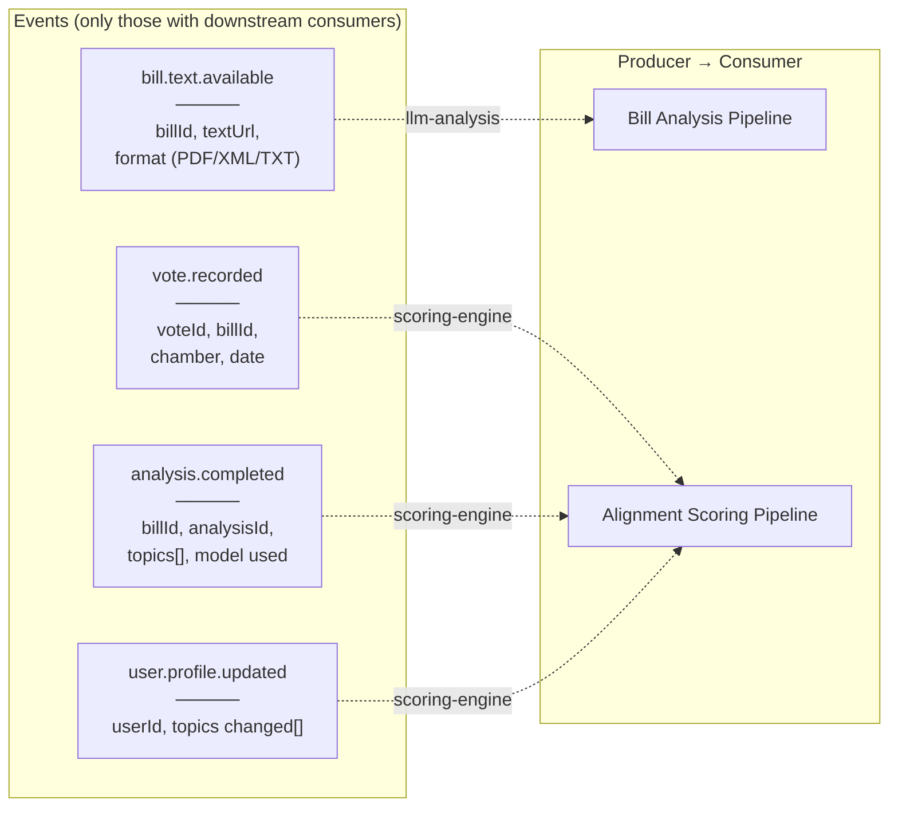

> Part of [System Design](../SYSTEM_DESIGN.md)

## Pub/Sub Event Catalog

> **Design principle**: Only emit Pub/Sub events when they trigger downstream actions. Pipelines that only persist data (members, amendments) do not publish events.

